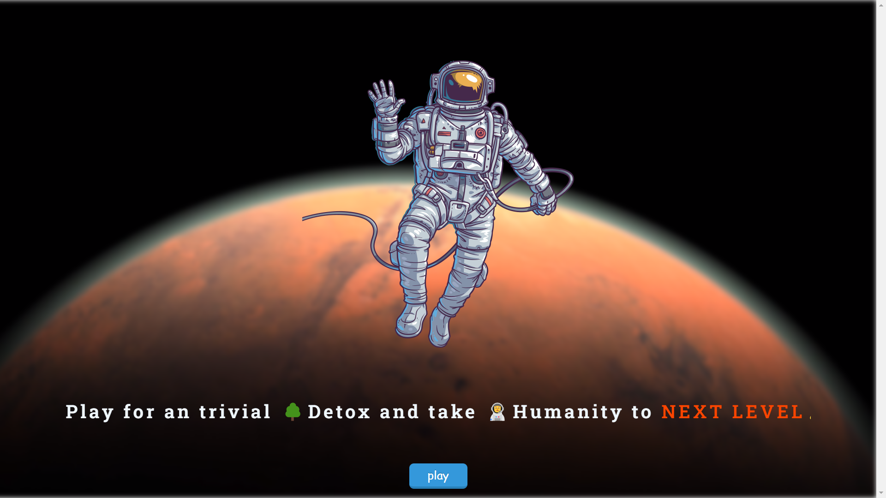

## 💡 Вдохновение 
🚀
Игра без интернета
Без интернета
## Что делает игра 👨‍🚀
"No Internet" - это увлекательная игра с боковой прокруткой, вдохновленная игрой Chrome Dino.  Концепция игры - предоставить развлекательный опыт, одновременно интегрируя образовательные элементы.  Игра вдохновлена ​​оффлайн-страницей Chrome, где пользователи встречают динозавра, когда нет интернет-соединения.

## ⚙️ Начало игры 🚀
Чтобы начать играть, просто нажмите кнопку "Играть" на главной странице.  Главная страница имитирует оффлайн-страницу Chrome, создавая знакомый и ностальгический опыт.  Как только вы нажмете кнопку "Играть", вы будете перенаправлены на страницу игры.

## 🔧 Механика игры 👨‍🚀
Игровые механики похожи на игру Chrome Dino, но с небольшим отличием.  Вместо управления динозавром, вы управляете различными миниатюрами, такими как астронавты, гусеницы и многое другое.  Эти миниатюры меняются периодически, по мере вашего продвижения в игре, добавляя визуальное разнообразие и азарт.

## 💪 Цель игры 🚀 ! 

Цель игры - пройти через динамически меняющиеся препятствия, демонстрируя элементы стратегии, точности и времени.  Фон игры посвящен космосу, что усиливает эффект погружения.

## 📌 Возможности для обучения 👨‍🚀  

По мере прохождения игры, вы также будете встречать на экране абзацы о космосе.  Эти абзацы предоставляют интересные факты и информацию о космосе, делая игру не только развлекательной, но и образовательной.

## ⏭ Готовы ли вы вывести человечество на новый уровень? 👨‍🚀
Если вы сумеете выиграть викторину, набрав полный балл, на экране появится поздравление.  Это сообщение означает, что вы готовы вывести человечество на новый уровень, символизируя ваши знания и опыт в космических темах. 

# UrfuProject
